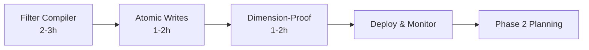

# Memory Palace Implementation Plan

Based on comprehensive analysis of Emma's suggestions and the current codebase state.

## Executive Summary

**Critical Issues Found:**
- 🔴 **SQL Injection vulnerabilities** in filter handling
- 🔴 **Dimension mismatches** between models and vector index
- 🟡 **Performance issues** from redundant clusterer loading
- 🟡 **Data consistency** issues from non-atomic writes
- 🟡 **Datetime type mismatches** causing timezone bugs

**Recommendation:** Implement Changes #1, #3, #4 immediately. Consider #2 and #5 for phase 2.

## Priority Matrix

| Change | Priority | Effort | Risk | Value | Verdict |
|--------|----------|--------|------|-------|---------|
| #1 Filter Compiler | **CRITICAL** | Medium (2-3h) | Low | High (Security) | **DO IT NOW** |
| #3 Atomic Writes | **HIGH** | Low (1-2h) | Low | High (Performance) | **DO IT NOW** |
| #4 Dimension-Proof | **HIGH** | Low (1-2h) | Low | High (Reliability) | **DO IT NOW** |
| #2 Vector Index DSL | Medium | Medium (2-3h) | Medium | Medium | Phase 2 |
| #5 DateTime Fix | Medium | High (4-6h + migration) | High | Medium | Consider Later |

## Phase 1: Critical Fixes (Do Immediately)

### 1. Filter Compiler (Change #1) - SECURITY CRITICAL
**Why:** Current implementation has SQL injection vulnerabilities
```python
# VULNERABLE CODE FOUND:
def _build_where_clause(self, filters: dict[str, Any]) -> str:
    return " AND ".join([f"m.{k} = '{v}'" for k, v in filters.items()])
```

**Implementation:**
1. Create `src/memory_palace/infrastructure/neo4j/filter_compiler.py`
2. Replace all filter string interpolation in repositories
3. Add unit tests for injection attempts
4. Support advanced operators (`$or`, `__lt`, `__overlap`)

**Effort:** 2-3 hours
**Risk:** Low (additive change)
**Testing:** Unit tests for filter compilation, injection tests

### 2. Atomic Writes & Clusterer Fix (Change #3) - PERFORMANCE WIN
**Why:** 
- Clusterer reloaded on every request (unnecessary DB hits)
- 5+ transactions per conversation turn
- Potential data inconsistency

**Implementation:**
1. Make `get_memory_service()` an async generator
2. Inject global clusterer into MemoryService
3. Create atomic turn write query
4. Fix session lifecycle management

**Effort:** 1-2 hours
**Risk:** Low (mostly dependency injection)
**Testing:** Integration tests for turn storage

### 3. Dimension-Proof Embeddings (Change #4) - RELIABILITY
**Why:**
- Vector index hardcoded to 1024 dims
- Cache doesn't account for model changes
- Silent failures on model switch

**Implementation:**
1. Make `ensure_vector_index()` dynamic
2. Add model name to cache keys
3. Validate dimensions at runtime
4. Store model metadata with embeddings

**Effort:** 1-2 hours
**Risk:** Low (defensive programming)
**Testing:** Unit tests for dimension validation

## Phase 2: Performance Optimizations (Consider Later)

### 4. Vector Index in DSL (Change #2)
**Current State:** Mixed - repository uses index, DSL doesn't
**Benefit:** 5-10x speedup for complex similarity queries
**Complexity:** Medium - requires DSL refactoring
**Verdict:** Worth doing but not urgent

### 5. DateTime Consistency (Change #5)
**Current State:** Numeric timestamps in DB, datetime in models
**Issues:** Timezone loss, type mismatches
**Complexity:** HIGH - requires data migration
**Verdict:** Consider as part of larger refactor

## What NOT to Do (Over-Engineering)

### Skip These Suggestions:
1. **Embeddable label optimization** - Premature optimization
2. **Complex reranking formula** - Current similarity works fine
3. **Full DSL rewrite** - Current implementation is functional

## Implementation Order



## Detailed Implementation Steps

### Step 1: Filter Compiler (2-3 hours)
```python
# Create new file: src/memory_palace/infrastructure/neo4j/filter_compiler.py
# Copy implementation from notes.md lines 23-106

# Update repositories to use compiler:
from memory_palace.infrastructure.neo4j.filter_compiler import compile_filters

# Replace string interpolation with:
where_clause, params = compile_filters(filters, alias="m")
```

### Step 2: Fix Clusterer Loading (30 minutes)
```python
# In api/dependencies.py:
clustering_service: DBSCANClusteringService | None = None

async def get_memory_service() -> AsyncGenerator[MemoryService, None]:
    async with neo4j_driver.session() as session:
        service = MemoryService(session=session, embeddings=embedding_service)
        service.clusterer = clustering_service  # Inject, don't reload
        yield service

# In main.py after clustering_service init:
dependencies.clustering_service = clustering_service
```

### Step 3: Atomic Turn Write (1-1.5 hours)
```python
# Add to services/memory_service.py:
async def remember_turn_atomic(self, user_content: str, assistant_content: str, ...):
    # Single query implementation from notes.md lines 269-289
    # One transaction for all operations
```

### Step 4: Dynamic Vector Index (1 hour)
```python
# Update infrastructure/neo4j/driver.py:
async def ensure_vector_index(driver: AsyncDriver, dims: int) -> None:
    # Check existing index dimensions
    # Recreate if mismatch
    # Implementation from notes.md lines 323-343

# In main.py:
dims = embedding_service.get_model_dimensions()
await ensure_vector_index(neo4j_driver, dims)
```

### Step 5: Cache Model Awareness (30 minutes)
```python
# Update cache.py:
def get_cached(self, text: str, model: str) -> list[float] | None:
    key = hashlib.md5(f"{model}::{text}".encode()).hexdigest()
    # Rest of implementation from notes.md
```

## Testing Strategy

### Unit Tests Required:
1. Filter compiler with injection attempts
2. Dimension validation
3. Cache key generation with model names

### Integration Tests:
1. Atomic turn storage
2. Model switching scenarios
3. Session lifecycle

## Rollback Plan
All changes are additive or behind feature flags:
1. Filter compiler can fallback to old method
2. Atomic writes can coexist with old method
3. Dimension checks are defensive (don't break existing)

## Success Metrics
- ✅ No SQL injection vulnerabilities
- ✅ Single transaction per turn (5x → 1x)
- ✅ Clusterer loads once at startup
- ✅ Model switches detected and handled
- ✅ All existing tests pass

## Total Effort Estimate
**Phase 1:** 5-7 hours total
- Filter Compiler: 2-3h
- Atomic Writes: 1-2h  
- Dimension-Proof: 1-2h

**Phase 2:** 6-9 hours (if pursued)
- Vector Index DSL: 2-3h
- DateTime Migration: 4-6h

## Recommendation

**Do Phase 1 immediately** - these are critical security and reliability fixes with low risk and high value.

**Defer Phase 2** - these are nice-to-haves that can wait. The datetime issue in particular needs careful planning due to migration requirements.

**Skip the "clever" optimizations** - the suggested reranking formulas and Embeddable labels are premature optimization.